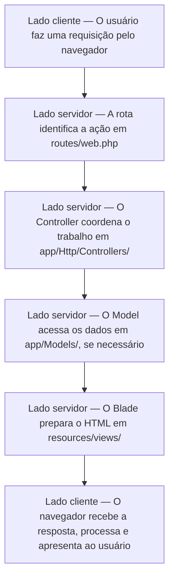
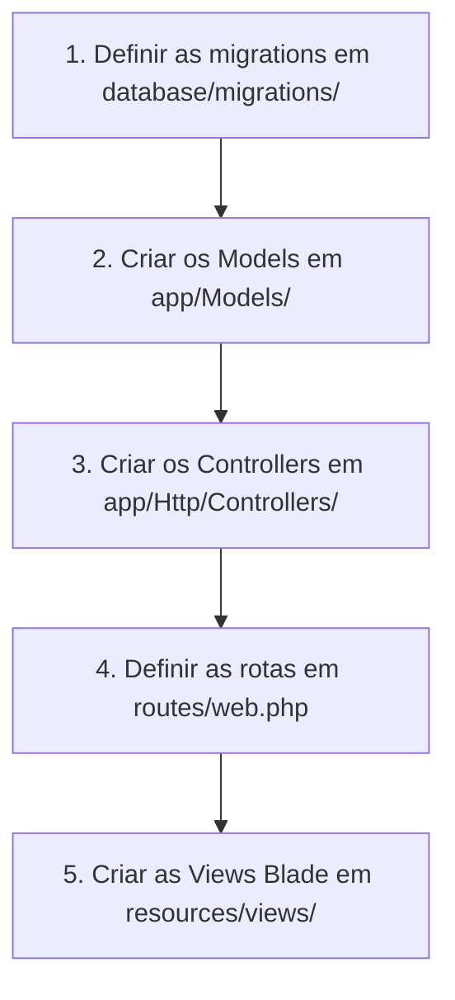

# Primeiro contato com o Laravel

Laravel reúne uma estrutura organizada e recursos prontos para desenvolver aplicações Web em PHP. Nesta apostila, você conhecerá o caminho básico de uma requisição e os principais termos, pastas, arquivos e recursos do framework.

## Índice remissivo

Os links levam diretamente a cada assunto da apostila.

| Termo | Onde consultar |
|---|---|
| Arquivos da raiz | [Arquivos importantes da raiz](#arquivos-importantes-da-raiz) |
| Artisan | [Artisan, Composer, npm e Vite](#10-artisan-composer-npm-e-vite) |
| Autenticação e autorização | [Autenticação, autorização e Policies](#8-autenticação-autorização-e-policies) |
| Blade | [Views e Blade](#views-e-blade) |
| Composer | [Artisan, Composer, npm e Vite](#10-artisan-composer-npm-e-vite) |
| Configurações | [Configurações e arquivo `.env`](#6-configurações-e-arquivo-env) |
| Controllers | [Controllers](#controllers) |
| CRUD | [Fluxo básico para desenvolver um CRUD](#4-fluxo-básico-para-desenvolver-um-crud) |
| Documentação oficial | [Como consultar a documentação oficial](#12-como-consultar-a-documentação-oficial) |
| Eloquent | [Eloquent](#eloquent) |
| E-mails e Mailables | [Envio de e-mails](#envio-de-e-mails) |
| `.env` e `.env.example` | [Configurações e arquivo `.env`](#6-configurações-e-arquivo-env) |
| Factories | [Factories](#factories) |
| Git e `.gitignore` | [`.gitignore`: o que não deve ir para o GitHub](#11-gitignore-o-que-não-deve-ir-para-o-github) |
| Laravel | [O que é Laravel?](#1-o-que-é-laravel) |
| Logs | [Logs e investigação de erros](#logs-e-investigação-de-erros) |
| Migrations | [Migrations](#migrations) |
| Models | [Models](#models) |
| `node_modules/` | [`.gitignore`: o que não deve ir para o GitHub](#11-gitignore-o-que-não-deve-ir-para-o-github) |
| Novidades do Laravel 13 | [Algumas novidades do Laravel 13](#13-algumas-novidades-do-laravel-13) |
| npm e Vite | [Artisan, Composer, npm e Vite](#10-artisan-composer-npm-e-vite) |
| Pastas do projeto | [Principais pastas](#principais-pastas) |
| Policies | [Autenticação, autorização e Policies](#8-autenticação-autorização-e-policies) |
| Requisições | [Como uma requisição passa pelo Laravel?](#2-como-uma-requisição-passa-pelo-laravel) |
| Rotas | [Rotas](#rotas) |
| Seeders | [Seeders](#seeders) |
| Storage e upload | [Storage e arquivos enviados](#storage-e-arquivos-enviados) |
| `vendor/` | [`.gitignore`: o que não deve ir para o GitHub](#11-gitignore-o-que-não-deve-ir-para-o-github) |
| Views | [Views e Blade](#views-e-blade) |

## 1. O que é Laravel?

Laravel é um **framework para desenvolvimento de aplicações Web em PHP**. Um framework oferece uma estrutura e ferramentas prontas para tarefas comuns. O programador utiliza essa base para construir sua aplicação.

Em um projeto PHP pequeno, podemos colocar diferentes tarefas em poucos arquivos. Quando o sistema cresce, isso dificulta a manutenção. O Laravel separa responsabilidades e estabelece lugares conhecidos para rotas, dados, telas e configurações.

Entre os principais recursos do Laravel estão:

- organização padronizada de pastas e arquivos;
- rotas e Controllers;
- acesso ao banco de dados com Eloquent;
- migrations para controlar a estrutura do banco;
- páginas criadas com Blade;
- validação de dados;
- autenticação e autorização;
- armazenamento de arquivos;
- envio de e-mails;
- registros de erros e acontecimentos;
- comandos que ajudam a gerar e inspecionar o código.

Laravel pode produzir uma aplicação completa, com banco de dados e páginas HTML, ou fornecer uma API. Na maior parte da disciplina, usaremos Laravel com Blade.

## 2. Como uma requisição passa pelo Laravel?

O diagrama abaixo mostra um fluxo comum de uma página quando a aplicação está funcionando.



As requisições entram por `public/index.php`. O Laravel é inicializado a partir de `bootstrap/app.php`, passa pelos **middlewares** e procura a rota correspondente. Middlewares são verificações executadas durante a requisição, como conferir se o usuário está autenticado. Não é necessário compreender todo esse processo interno agora.

Nem toda requisição utiliza todas as partes do diagrama. Uma rota pode devolver diretamente um texto, um arquivo, um redirecionamento ou uma resposta JSON. Uma página sem acesso ao banco, por exemplo, pode não precisar de um Model.

## 3. Rotas, Controllers, Models, Eloquent, Views e Blade

Esses componentes aparecem no fluxo anterior e formam a base de muitas páginas desenvolvidas com Laravel.

### Rotas

Uma rota associa um endereço e um método HTTP a uma ação. As rotas das páginas Web ficam principalmente em `routes/web.php`.

```php
Route::get('/livros', [BookController::class, 'index']);
```

Essa rota informa que uma requisição `GET` para `/livros` deve executar o método `index` de `BookController`.

Os métodos HTTP mais comuns são `GET`, `POST`, `PUT`, `PATCH` e `DELETE`. Eles serão estudados com mais detalhes posteriormente.

O arquivo `routes/api.php` pode aparecer em projetos que fornecem uma API. No Laravel 13, ele é opcional e pode não existir em um projeto novo.

### Controllers

Um **Controller** (controlador) recebe o fluxo da rota, solicita operações, prepara dados e escolhe a resposta. Controllers ficam em `app/Http/Controllers/`.

Um Controller não deve concentrar automaticamente todo o código do sistema. Sua principal função é coordenar o trabalho necessário para responder à requisição.

### Models

Um **Model** (modelo) é uma classe PHP usada pela aplicação para consultar e modificar dados. Models ficam normalmente em `app/Models/`. O Model `Book`, por exemplo, costuma trabalhar com registros da tabela `books`.

### Eloquent

O **Eloquent** é a ferramenta do Laravel que liga Models a tabelas do banco de dados. Esse tipo de ferramenta é chamado de ORM. Com o Eloquent, várias operações são escritas usando Models e métodos PHP, mas o banco continua executando SQL internamente.

### Views e Blade

Uma **View** (visualização) é responsável pela apresentação e fica em `resources/views/`. Laravel utiliza principalmente o **Blade**, seu sistema de templates. Um arquivo Blade termina com `.blade.php`.

```blade
<h1>{{ $titulo }}</h1>

@foreach ($livros as $livro)
    <p>{{ $livro->title }}</p>
@endforeach
```

As chaves `{{ }}` exibem um valor. Diretivas iniciadas com `@`, como `@if` e `@foreach`, permitem condições e repetições. O Blade prepara o HTML no servidor; o navegador recebe o resultado pronto e não executa o código PHP.

## 4. Fluxo básico para desenvolver um CRUD

Depois de conhecer os principais componentes, podemos observar uma sequência comum para organizar o desenvolvimento de um CRUD:



CRUD é a sigla para **Create, Read, Update e Delete**: criar, consultar, atualizar e excluir. Essa ordem funciona como uma referência inicial e pode mudar conforme as necessidades do projeto.

## 5. Como o projeto é organizado

### Principais pastas

Algumas pastas são usadas frequentemente; outras precisam apenas ser reconhecidas neste momento.

| Pasta | O que encontramos nela |
|---|---|
| `app/` | Código principal da aplicação |
| `app/Http/Controllers/` | Controllers |
| `app/Models/` | Models usados pelo Eloquent |
| `routes/` | Arquivos de rotas |
| `resources/views/` | Views e componentes Blade |
| `resources/css/` e `resources/js/` | Código-fonte de CSS e JavaScript |
| `database/migrations/` | Alterações na estrutura do banco |
| `database/factories/` | Receitas para gerar dados fictícios |
| `database/seeders/` | Classes que inserem dados iniciais ou de demonstração |
| `config/` | Configurações da aplicação e dos serviços |
| `storage/` | Arquivos, cache, sessões, versões temporárias das Views e logs |
| `public/` | Entrada da aplicação e arquivos acessíveis pelo navegador |
| `bootstrap/` | Inicialização do Laravel e arquivos de cache interno |
| `tests/` | Testes automatizados |
| `vendor/` | Dependências PHP instaladas pelo Composer |
| `node_modules/` | Dependências da parte visual instaladas pelo npm |

Algumas pastas podem não aparecer imediatamente. Por exemplo, `app/Policies/` e `app/Mail/` costumam ser criadas quando a primeira Policy ou classe de e-mail é gerada.

### Arquivos importantes da raiz

Na pasta principal também existem arquivos importantes.

| Arquivo | Finalidade |
|---|---|
| `artisan` | Executa comandos do Laravel |
| `.env` | Guarda configurações locais e informações sensíveis |
| `.env.example` | Modelo seguro das configurações necessárias |
| `.gitignore` | Define o que o Git não deve acompanhar |
| `composer.json` | Lista dependências PHP e comandos do projeto |
| `composer.lock` | Registra as versões exatas das dependências PHP |
| `package.json` | Lista dependências e comandos da parte visual |
| `package-lock.json` | Registra as versões exatas das dependências JavaScript |
| `vite.config.js` | Configura o processamento do CSS e JavaScript |
| `bootstrap/app.php` | Participa da inicialização e configuração da aplicação |
| `public/index.php` | Recebe as requisições Web |

Você não precisa editar todos eles. Primeiro, reconheça suas finalidades.

## 6. Configurações e arquivo `.env`

Os arquivos da pasta `config/` organizam configurações relacionadas ao banco de dados, e-mail, armazenamento, logs e outros recursos.

O `.env` contém valores que mudam entre computadores e ambientes. Desenvolvimento e produção, por exemplo, podem usar bancos e credenciais diferentes.

Exemplo reduzido:

```dotenv
APP_NAME=Biblioteca
APP_ENV=local
DB_CONNECTION=mysql
DB_DATABASE=biblioteca
DB_USERNAME=biblioteca
DB_PASSWORD=
```

O `.env` também contém a `APP_KEY`, usada por mecanismos de criptografia do Laravel. Senhas, chaves e credenciais reais nunca devem aparecer em exemplos, atividades ou commits.

O `.env.example` mostra quais variáveis são necessárias, mas contém somente valores vazios ou seguros. Assim, outra pessoa pode preparar seu `.env` sem receber credenciais privadas.

## 7. Migrations, Factories e Seeders

Models e Eloquent foram apresentados na seção 3. Agora precisamos diferenciar três recursos usados para preparar a estrutura e os dados do banco.

| Recurso | Pergunta que ele responde |
|---|---|
| Migration | Como deve ser a estrutura do banco? |
| Factory | Como gerar dados fictícios? |
| Seeder | Quais dados devem ser inseridos? |

### Migrations

Uma migration registra uma mudança na estrutura do banco, como criar uma tabela ou adicionar uma coluna. Ela fica em `database/migrations/`.

O método `up` aplica a alteração e o método `down` descreve como desfazê-la. Depois que uma migration foi executada e compartilhada, preserve seu histórico. Para alterar novamente a estrutura, crie outra migration em vez de editar silenciosamente o arquivo anterior.

### Factories

Uma factory funciona como uma **receita para gerar dados fictícios de uma entidade**. Uma `BookFactory`, por exemplo, descreve como produzir livros falsos com títulos, ISBNs e anos. As factories ficam em `database/factories/` e geralmente usam o Faker, uma biblioteca que gera dados de demonstração.

### Seeders

Um seeder insere dados iniciais ou de demonstração. Ele pode cadastrar valores fixos ou chamar factories. Os seeders ficam em `database/seeders/`.

Migration não guarda dados, factory não cria tabela e seeder não define a estrutura do banco. Cada recurso resolve um problema diferente.

## 8. Autenticação, autorização e Policies

Dois conceitos não devem ser confundidos:

- **autenticação:** identifica quem é o usuário;
- **autorização:** verifica o que esse usuário pode fazer.

Uma **Policy** organiza regras de autorização relacionadas a um recurso ou Model. Uma `BookPolicy`, por exemplo, pode decidir se um usuário tem permissão para atualizar ou excluir determinado livro.

No sistema de biblioteca, `admin`, `bibliotecario` e `cliente` podem ter permissões diferentes. A implementação será estudada posteriormente.

## 9. Outros recursos importantes

Além da estrutura básica das páginas e do banco, o Laravel oferece recursos prontos para outras tarefas comuns.

### Storage e arquivos enviados

Laravel oferece uma forma padronizada de armazenar e recuperar arquivos. A configuração principal fica em `config/filesystems.php`.

- `storage/app/private` é usado para arquivos privados;
- `storage/app/public` é usado para arquivos que podem ser disponibilizados publicamente;
- `public/storage` é uma ligação que permite ao navegador acessar os arquivos públicos.

No sistema de biblioteca, esse recurso pode armazenar as capas. O comando `php artisan storage:link` cria a ligação pública; o upload completo será estudado posteriormente.

### Envio de e-mails

As configurações de e-mail ficam em `config/mail.php`, enquanto credenciais e valores específicos do serviço normalmente ficam no `.env`.

Laravel representa cada tipo de e-mail com uma classe chamada **Mailable**, geralmente armazenada em `app/Mail/`. O conteúdo do e-mail também pode ser criado com uma View Blade.

Durante o desenvolvimento, o Laravel pode registrar o e-mail no log em vez de enviá-lo, permitindo conferir seu conteúdo sem um serviço externo.

### Logs e investigação de erros

Logs são registros de erros e acontecimentos da aplicação. Eles ficam normalmente em `storage/logs/`. O arquivo mais conhecido é `storage/logs/laravel.log`, e as configurações ficam em `config/logging.php`.

Quando o navegador apresenta uma mensagem genérica, o log pode revelar a causa: falha no banco, arquivo ausente ou classe não encontrada.

Logs não são código-fonte, podem crescer bastante e podem conter informações do ambiente. Por isso, não devem ser enviados ao GitHub.

## 10. Artisan, Composer, npm e Vite

| Ferramenta | Papel no projeto |
|---|---|
| Artisan | Executa comandos específicos do Laravel |
| Composer | Gerencia as dependências PHP |
| npm | Gerencia as dependências de CSS e JavaScript |
| Vite | Processa e prepara os arquivos da parte visual |

Artisan pode gerar arquivos, executar migrations e listar rotas. Não memorize todos os comandos: consulte a documentação ou use `php artisan list`.

O Composer instala as dependências PHP em `vendor/`. O npm instala as dependências da parte visual em `node_modules/`, e o Vite processa os arquivos CSS e JavaScript usados pela aplicação.

## 11. `.gitignore`: o que não deve ir para o GitHub

O `.gitignore` informa ao Git quais arquivos e pastas devem ficar fora do repositório.

> **Regra da disciplina:** não altere o `.gitignore` do Laravel para forçar o envio de arquivos ignorados ao GitHub.

Essa regra protege o projeto por dois motivos principais:

1. arquivos como `.env` podem conter senhas, chaves e credenciais;
2. pastas como `vendor/` e `node_modules/`, além de logs, caches e temporários, podem ocupar muito espaço e podem ser reconstruídas.

| Deve ir para o GitHub | Não deve ir para o GitHub |
|---|---|
| `.gitignore` | `.env` |
| `.env.example` | `vendor/` |
| `composer.json` e `composer.lock` | `node_modules/` |
| `package.json` e `package-lock.json` | logs, caches e temporários |
| código da aplicação | credenciais e chaves privadas |

As dependências PHP são reconstruídas a partir de `composer.json` e `composer.lock`. As de frontend usam `package.json` e `package-lock.json`. Esses arquivos são versionados, mas as pastas baixadas não são.

## 12. Como consultar a documentação oficial

A documentação principal da disciplina é a [documentação oficial do Laravel 13](https://laravel.com/framework/docs/13.x).

Confira se a versão selecionada é `13.x`. Use o menu lateral e a busca do navegador. Associe o termo da apostila ao título correspondente em inglês.

| Quero estudar | Onde procurar |
|---|---|
| Pastas e arquivos | [Directory Structure](https://laravel.com/framework/docs/13.x/structure) |
| `.env` e configurações | [Configuration](https://laravel.com/framework/docs/13.x/configuration) |
| Rotas | [Routing](https://laravel.com/framework/docs/13.x/routing) |
| Controllers | [Controllers](https://laravel.com/framework/docs/13.x/controllers) |
| Views e Blade | [Views](https://laravel.com/framework/docs/13.x/views) e [Blade Templates](https://laravel.com/framework/docs/13.x/blade) |
| Migrations e seeders | [Migrations](https://laravel.com/framework/docs/13.x/migrations) e [Database Seeding](https://laravel.com/framework/docs/13.x/seeding) |
| Models e factories | [Eloquent ORM](https://laravel.com/framework/docs/13.x/eloquent) e [Eloquent Factories](https://laravel.com/framework/docs/13.x/eloquent-factories) |
| Policies | [Authorization](https://laravel.com/framework/docs/13.x/authorization) |
| Arquivos | [File Storage](https://laravel.com/framework/docs/13.x/filesystem) |
| E-mails | [Mail](https://laravel.com/framework/docs/13.x/mail) |
| Logs | [Logging](https://laravel.com/framework/docs/13.x/logging) |

Use a tradução do navegador quando necessário. Comece pela introdução e pelos exemplos simples. Não copie código sem entender em qual arquivo ele deve ficar e qual problema resolve.

## 13. Algumas novidades do Laravel 13

Os recursos a seguir não fazem parte do núcleo inicial da disciplina. O objetivo é apenas conhecer sua existência.

- **PHP 8.3 ou superior:** Laravel 13 elevou a versão mínima necessária do PHP.
- **Laravel AI SDK:** conjunto oficial de ferramentas para integrar serviços e modelos de inteligência artificial.
- **JSON:API Resources:** recursos para construir APIs seguindo o padrão JSON:API.
- **Mais atributos PHP:** algumas configurações podem ser declaradas diretamente nas classes com atributos.
- **Busca semântica e vetorial:** recursos úteis para procurar conteúdos pelo significado, especialmente em aplicações relacionadas à inteligência artificial.

O surgimento de novos recursos não elimina os fundamentos. Rotas, Controllers, Models, Blade, migrations, configurações e segurança continuam sendo a base para compreender aplicações Laravel.

## 14. Quadro de consulta rápida

| Termo | Lembrete |
|---|---|
| Route | Liga um endereço a uma ação |
| Controller | Coordena a requisição |
| Model | Representa e manipula dados da aplicação |
| Eloquent | Faz a ligação entre Models e banco de dados |
| View | Apresenta o conteúdo |
| Blade | Sistema de templates do Laravel |
| Migration | Registra mudanças na estrutura do banco |
| Factory | Funciona como uma receita para gerar dados fictícios |
| Seeder | Organiza a inserção de dados |
| Policy | Organiza regras de autorização |
| Storage | Armazena e recupera arquivos |
| Mailable | Representa um tipo de e-mail |
| Log | Registra erros e acontecimentos |
| Artisan | Ferramenta de comandos do Laravel |

## O que você precisa guardar

1. Laravel organiza a aplicação e fornece recursos prontos para problemas comuns.
2. A rota identifica a ação, o Controller coordena, o Model trabalha com dados e a View apresenta a resposta.
3. Uma sequência inicial comum para desenvolver um CRUD passa por migration, Model, Controller, rota e View.
4. Cada tipo de código possui uma pasta e uma responsabilidade.
5. Models trabalham com registros; migrations, factories e seeders possuem funções próprias na preparação do banco e dos dados.
6. O `.env`, as credenciais, `vendor/`, `node_modules/`, logs e temporários não devem ser enviados ao GitHub; por isso, não altere o `.gitignore` para forçar o envio desses arquivos.
7. Você não precisa memorizar tudo: use esta apostila e a documentação oficial como fontes de consulta.

## Para continuar estudando

Esta apostila apresenta apenas o mapa inicial. Os materiais seguintes aprofundam alguns dos recursos apresentados:

- [Ambiente, framework e MVC](../02-ambiente-framework-mvc/)
- [Migrations e Models](../03-migrations-models/)
- [Factories, Seeders e Eloquent](../04-factories-seeders-eloquent/)

## Referências

- [Documentação oficial do Laravel 13](https://laravel.com/framework/docs/13.x)
- [Estrutura de diretórios](https://laravel.com/framework/docs/13.x/structure)
- [Configuração](https://laravel.com/framework/docs/13.x/configuration)
- [Rotas](https://laravel.com/framework/docs/13.x/routing)
- [Migrations](https://laravel.com/framework/docs/13.x/migrations)
- [Eloquent](https://laravel.com/framework/docs/13.x/eloquent)
- [Blade](https://laravel.com/framework/docs/13.x/blade)
- [Autorização](https://laravel.com/framework/docs/13.x/authorization)
- [Armazenamento de arquivos](https://laravel.com/framework/docs/13.x/filesystem)
- [E-mails](https://laravel.com/framework/docs/13.x/mail)
- [Logs](https://laravel.com/framework/docs/13.x/logging)
- [Novidades e notas de lançamento](https://laravel.com/framework/docs/13.x/releases)
