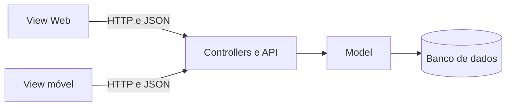

# MVC: separando responsabilidades em aplicações Web

Em uma aplicação pequena, pode parecer mais fácil colocar tudo no mesmo arquivo: leitura do formulário, regras, acesso aos dados e HTML.

Essa solução funciona no início. Porém, conforme o sistema cresce, o arquivo passa a reunir muitas responsabilidades. Uma alteração na interface pode afetar regras importantes, e uma mudança no armazenamento dos dados pode exigir modificações em várias partes do código.

O padrão **MVC** ajuda a controlar essa complexidade ao separar a aplicação em partes com responsabilidades diferentes.

Mais importante do que decorar o significado das três letras é compreender:

- qual responsabilidade pertence a cada parte;
- como essas partes colaboram;
- por que essa separação facilita a evolução da aplicação.

## Índice

1. [Por que organizar a arquitetura?](#1-por-que-organizar-a-arquitetura)
2. [O que é uma arquitetura em camadas?](#2-o-que-é-uma-arquitetura-em-camadas)
3. [O que é MVC?](#3-o-que-é-mvc)
4. [Uma analogia para compreender o MVC](#4-uma-analogia-para-compreender-o-mvc)
5. [Responsabilidades de Model, View e Controller](#5-responsabilidades-de-model-view-e-controller)
6. [O fluxo de uma requisição no MVC](#6-o-fluxo-de-uma-requisição-no-mvc)
7. [CRUD e MVC](#7-crud-e-mvc)
8. [MVC e arquitetura cliente-servidor](#8-mvc-e-arquitetura-cliente-servidor)
9. [Uma View separada do back-end](#9-uma-view-separada-do-back-end)
10. [MVC no Laravel](#10-mvc-no-laravel)
11. [Exemplos em PHP puro](#11-exemplos-em-php-puro)
12. [Benefícios, limitações e erros comuns](#12-benefícios-limitações-e-erros-comuns)
13. [Quadro de consulta rápida](#13-quadro-de-consulta-rápida)

## 1. Por que organizar a arquitetura?

Uma aplicação Web real pode envolver:

- páginas e formulários;
- regras de negócio;
- autenticação e autorização;
- acesso ao banco de dados;
- envio de e-mails;
- integração com APIs;
- diferentes tipos de usuários;
- interfaces Web e móveis;
- várias pessoas trabalhando no mesmo código.

Sem uma organização, essas responsabilidades podem ficar misturadas.

Podemos pensar na arquitetura de uma aplicação como a planta de um prédio. A planta não constrói o prédio, mas ajuda a definir:

- quais partes existem;
- qual é a função de cada parte;
- como as partes se comunicam;
- quais dependências devem ser evitadas.

A arquitetura não é apenas a estrutura de pastas. Ela representa decisões sobre a organização e a comunicação entre os componentes do sistema.

## 2. O que é uma arquitetura em camadas?

Uma **arquitetura em camadas** divide a aplicação em grupos de responsabilidades.

Em vez de todo o código poder fazer qualquer coisa, cada camada recebe uma função principal e se comunica com outras camadas por meio de caminhos conhecidos.

Um exemplo comum é separar:

| Camada | Responsabilidade geral |
|---|---|
| Apresentação | Interação com o usuário |
| Aplicação ou controle | Coordenação das operações |
| Negócio ou domínio | Regras e comportamentos do sistema |
| Dados | Armazenamento e recuperação de informações |

Essa divisão não precisa corresponder exatamente a quatro pastas ou quatro arquivos. Em sistemas pequenos, várias camadas podem estar no mesmo projeto. Em sistemas maiores, uma camada pode possuir muitos arquivos, classes e até um projeto próprio.

A documentação da Microsoft diferencia **camada** de **nível físico**: uma camada representa uma separação lógica de responsabilidades, enquanto partes implantadas em servidores ou processos diferentes representam uma separação física. Portanto, uma aplicação pode ter várias camadas e continuar executando em um único servidor. [Microsoft Learn — Common web application architectures](https://learn.microsoft.com/en-us/dotnet/architecture/modern-web-apps-azure/common-web-application-architectures).

### Vantagens da arquitetura em camadas

| Vantagem | Como ajuda |
|---|---|
| Organização | Facilita localizar onde cada funcionalidade está implementada |
| Manutenção | Reduz o impacto de uma alteração sobre partes não relacionadas |
| Trabalho em equipe | Permite distribuir responsabilidades entre pessoas ou equipes |
| Testes | Possibilita testar regras sem depender da interface completa |
| Reutilização | Uma mesma regra pode ser utilizada por interfaces diferentes |
| Substituição | Uma implementação pode ser trocada quando mantém a mesma interface de comunicação |
| Evolução | Novas funcionalidades podem ser acrescentadas de forma mais controlada |

Esses benefícios não aparecem apenas porque foram criadas várias pastas. É necessário respeitar as responsabilidades e controlar as dependências entre as camadas.

## 3. O que é MVC?

**MVC** significa:

- **Model:** Modelo;
- **View:** Visão, Visualização ou Interface;
- **Controller:** Controlador ou Controle.

O MVC é um padrão utilizado para separar a apresentação, o controle das interações e os dados e regras da aplicação.

A [MDN define o MVC](https://developer.mozilla.org/en-US/docs/Glossary/MVC) como um padrão que separa a lógica de negócio da apresentação, melhorando a divisão do trabalho e a manutenção.

De forma resumida:

| Parte | Responsabilidade principal |
|---|---|
| Model | Dados, regras e comportamentos da aplicação |
| View | Apresentação e interação com o usuário |
| Controller | Coordenação do fluxo entre entrada, Model e resposta |

MVC não é uma linguagem de programação e também não é um framework. É um padrão que pode ser utilizado por diferentes linguagens e frameworks.

Laravel, Django, Spring e ASP.NET Core, por exemplo, aplicam conceitos relacionados ao MVC, embora cada ferramenta possua suas próprias convenções.

> O objetivo do MVC não é apenas dividir o código em três arquivos. O objetivo é separar responsabilidades.

## 4. Uma analogia para compreender o MVC

Podemos comparar o MVC ao funcionamento de um restaurante.

| Restaurante | MVC |
|---|---|
| Cardápio, mesa e apresentação do prato | View |
| Garçom que recebe o pedido e coordena o atendimento | Controller |
| Cozinha, receitas e regras de preparo | Model |
| Despensa e registro dos pedidos | Banco de dados |

O cliente interage com o cardápio e faz um pedido. O garçom recebe esse pedido e o encaminha à cozinha. A cozinha conhece as receitas, verifica os ingredientes e prepara o resultado. O garçom leva o resultado até o cliente.

Na aplicação:

1. o usuário interage com a View;
2. o Controller recebe a ação;
3. o Controller solicita uma operação ao Model;
4. o Model aplica as regras e trabalha com os dados;
5. o Controller encaminha o resultado à View;
6. a View apresenta o resultado.

A analogia possui limites: uma aplicação não funciona exatamente como um restaurante. Ela serve apenas para destacar que cada participante possui uma responsabilidade.

### O exemplo das notas

Considere um sistema que calcula a média de um aluno:

- a **View** apresenta os campos para digitar as notas e mostra a média;
- o **Controller** recebe as notas e solicita o cálculo;
- o **Model** contém a regra usada para calcular a média e pode armazenar o resultado.

Se a fórmula da média mudar, a regra deve ser alterada no Model. Se mudarem apenas as cores ou a organização do formulário, a mudança deve ficar na View.

Outra analogia possível é um relógio. Quando todas as engrenagens estão misturadas, seu funcionamento parece complicado. Uma visão organizada mostra que cada engrenagem possui uma função e se conecta somente a determinadas peças. A arquitetura faz algo semelhante com os componentes de um software.

## 5. Responsabilidades de Model, View e Controller

### View

A View é responsável pela apresentação e pela interação com o usuário.

Atividades típicas:

- gerar ou organizar o HTML;
- apresentar textos, tabelas e imagens;
- exibir formulários;
- mostrar mensagens de sucesso ou erro;
- formatar datas e valores para apresentação;
- disponibilizar botões, links e campos;
- aplicar estilos e comportamentos da interface.

A View pode receber dados preparados por outras partes da aplicação, mas não deve decidir regras importantes do negócio.

Exemplos do que deve ser evitado na View:

- executar comandos SQL;
- calcular uma multa de empréstimo;
- decidir se um usuário pode realizar uma operação;
- alterar diretamente dados no banco;
- concentrar regras importantes dentro do HTML.

### Controller

O Controller coordena o fluxo da operação.

Atividades típicas:

- receber uma requisição ou ação do usuário;
- identificar qual operação foi solicitada;
- obter os dados enviados;
- chamar o Model ou outro componente responsável;
- escolher qual View ou resposta será produzida;
- redirecionar o usuário;
- coordenar mensagens de sucesso ou falha.

O Controller deve organizar a operação, mas não precisa executar pessoalmente todas as tarefas.

Exemplos do que deve ser evitado no Controller:

- comandos SQL espalhados;
- geração de grandes blocos de HTML;
- cálculos complexos de negócio;
- todas as regras do sistema concentradas em uma única classe.

Um Controller muito grande, que faz tudo sozinho, costuma ser chamado informalmente de **Controller gordo**.

### Model

O Model representa os dados, os conceitos e os comportamentos importantes para a aplicação.

Atividades típicas:

- representar livros, autores, usuários e empréstimos;
- consultar e armazenar informações;
- aplicar regras de negócio;
- realizar cálculos;
- validar condições do domínio;
- alterar o estado de um registro;
- interagir com mecanismos de persistência.

Exemplos de regras que podem pertencer ao Model:

- um livro indisponível não pode ser emprestado;
- a devolução após o prazo gera uma multa;
- um ISBN não pode ser duplicado;
- a quantidade em estoque não pode ficar negativa;
- a média do aluno é calculada segundo determinada fórmula.

> O Model não é sinônimo de banco de dados. O banco armazena dados; o Model representa os dados e comportamentos que fazem sentido para a aplicação.

## 6. O fluxo de uma requisição no MVC

Considere uma requisição para visualizar uma lista de livros:

```text
GET /livros
```

Um fluxo simplificado seria:

1. O navegador envia a requisição.
2. A aplicação identifica o Controller responsável.
3. O Controller solicita ao Model a lista de livros.
4. O Model recupera os dados.
5. O Model devolve o resultado ao Controller.
6. O Controller fornece os dados à View.
7. A View monta a apresentação.
8. A resposta é enviada ao navegador.

```text
Navegador
    ↓ requisição
Controller
    ↓ solicita operação
Model
    ↓ devolve dados
Controller
    ↓ fornece dados
View
    ↓ gera resposta
Navegador
```

Nem toda requisição precisa usar todas as partes. Uma página estática, por exemplo, pode não precisar consultar um Model.

## 7. CRUD e MVC

CRUD representa quatro operações básicas:

- **Create:** criar;
- **Read:** consultar;
- **Update:** atualizar;
- **Delete:** excluir.

CRUD e MVC não são a mesma coisa. CRUD descreve operações realizadas com os dados; MVC organiza as responsabilidades envolvidas nessas operações.

### Exemplo: cadastrar um livro

| Parte | Atividade |
|---|---|
| View | Exibe o formulário e os campos |
| Controller | Recebe os dados e solicita o cadastro |
| Model | Aplica as regras e armazena o livro |
| Controller | Define a resposta após a operação |
| View | Exibe a confirmação ou os erros |

### Exemplo: listar livros

| Parte | Atividade |
|---|---|
| Controller | Recebe a solicitação da listagem |
| Model | Consulta os livros |
| Controller | Encaminha os dados encontrados |
| View | Monta a tabela ou lista em HTML |

### Exemplo: atualizar um livro

O Controller identifica o livro e os dados enviados. O Model verifica as regras e realiza a alteração. A View apresenta o formulário e depois mostra o resultado.

### Exemplo: excluir um livro

O Controller recebe a solicitação. O Model verifica se a exclusão é permitida e remove o dado. A View apresenta a confirmação.

## 8. MVC e arquitetura cliente-servidor

MVC e cliente-servidor são conceitos relacionados, mas respondem a perguntas diferentes.

| Conceito | Pergunta principal |
|---|---|
| Cliente-servidor | Onde estão os componentes e como eles se comunicam? |
| MVC | Como as responsabilidades da aplicação estão organizadas? |

Na arquitetura cliente-servidor:

- o cliente inicia uma solicitação;
- o servidor processa essa solicitação;
- o servidor devolve uma resposta.

Na Web, o navegador normalmente representa o cliente. Ele envia requisições HTTP e recebe respostas do servidor. Esse comportamento é apresentado pela [MDN no resumo sobre cliente e servidor](https://developer.mozilla.org/en-US/docs/Learn_web_development/Extensions/Server-side/First_steps/Client-Server_overview).

### MVC renderizado no servidor

Em uma aplicação Laravel tradicional:

1. o navegador envia uma requisição;
2. o Controller e o Model executam no servidor;
3. uma View Blade também é processada no servidor;
4. o HTML resultante é enviado ao navegador;
5. o navegador apresenta o HTML.

Nesse caso, o código da View está no servidor, embora o resultado visual seja exibido no cliente.

### Front-end separado

Em outra organização, a interface pode ser um projeto separado:

- o front-end executa no navegador;
- o back-end fornece uma API;
- as partes se comunicam por HTTP;
- o back-end pode devolver dados em JSON, em vez de HTML pronto.

A documentação da Microsoft apresenta as SPAs como aplicações nas quais grande parte da lógica da interface executa no navegador e se comunica com o servidor principalmente por APIs Web. [Microsoft Learn — Traditional web apps and SPAs](https://learn.microsoft.com/en-us/dotnet/architecture/modern-web-apps-azure/choose-between-traditional-web-and-single-page-apps).

## 9. Uma View separada do back-end

A View pode ser desenvolvida em um projeto próprio e até por uma equipe diferente.

Por exemplo:

- uma equipe desenvolve o back-end em Laravel;
- outra desenvolve a interface Web em React;
- as duas partes se comunicam por uma API;
- a API define quais endereços, dados e respostas estão disponíveis.

Nesse cenário, a API funciona como um **contrato de comunicação**. O front-end não precisa saber como o back-end consulta o banco ou executa suas regras. O back-end também não precisa conhecer todos os detalhes visuais da interface.

A separação entre front-end e back-end é utilizada inclusive por ferramentas que criam projetos independentes para as duas partes. [Microsoft Learn — separação entre projetos de front-end e back-end](https://learn.microsoft.com/en-us/aspnet/core/client-side/spa/intro).

### Substituindo uma View

Uma View pode ser substituída sem alterar as regras e os dados da aplicação quando:

- a separação de responsabilidades foi respeitada;
- as regras importantes permanecem no back-end;
- o contrato da API continua compatível;
- a nova View envia e recebe os dados esperados.

Por exemplo, uma interface Blade pode ser substituída por uma aplicação React sem modificar as regras de empréstimo da biblioteca. Pode ser necessário adaptar a forma como as respostas são entregues, mas o Model e as regras de negócio não precisam ser reescritos.

A substituição não será simples se a View contiver regras que deveriam estar no Model ou acessar diretamente o banco.

### Mais de uma View

Um mesmo sistema pode oferecer várias formas de apresentação:

- uma interface Web para clientes;
- um aplicativo para celular;
- uma interface administrativa;
- uma aplicação para terminais de atendimento.



As duas Views podem utilizar os mesmos dados e regras do back-end. Cada interface adapta a apresentação ao seu público sem duplicar toda a lógica de negócio.

A separação entre apresentação e domínio permite oferecer diferentes apresentações sobre a mesma base e distribuir o trabalho entre profissionais com habilidades diferentes. [Martin Fowler — Presentation Domain Separation](https://martinfowler.com/bliki/PresentationDomainSeparation.html).

> Uma aplicação com front-end separado e API também pode ser descrita como uma arquitetura cliente-servidor com camada de apresentação separada. Nem todos os autores classificam essa organização como o MVC clássico. O princípio mais importante aqui é a separação das responsabilidades.

## 10. MVC no Laravel

O Laravel utiliza convenções relacionadas ao MVC.

| Parte | Local comum no Laravel |
|---|---|
| Model | `app/Models` |
| View | `resources/views` |
| Controller | `app/Http/Controllers` |

Exemplo de correspondência:

```text
app/Models/Book.php
app/Http/Controllers/BookController.php
resources/views/books/index.blade.php
```

As rotas normalmente ficam em:

```text
routes/web.php
```

A rota associa um endereço a uma ação do Controller:

```php
Route::get('/livros', [BookController::class, 'index']);
```

A rota ajuda a encaminhar a requisição, mas não precisa ser considerada uma quarta camada do MVC.

Aplicações Laravel reais também utilizam outros componentes, como Form Requests, Services, Policies, Jobs e Repositories. O MVC organiza uma parte importante da aplicação, mas não descreve sozinho toda a arquitetura de um sistema grande.

## 11. Exemplos em PHP puro

Os exemplos relacionados a esta apostila apresentam o mesmo CRUD minimalista em duas versões. Eles armazenam os livros separadamente na sessão do navegador e não precisam de banco de dados.

```text
exemplos/
├── 01-crud-acoplado/
│   └── index.php
└── 02-crud-mvc/
    ├── model.php
    ├── controller.php
    └── view.php
```

Para executar os exemplos, entre na pasta `03-mvc` e inicie o servidor embutido do PHP:

```bash
php -S localhost:8000
```

Depois, acesse:

- [http://localhost:8000/exemplos/01-crud-acoplado/index.php](http://localhost:8000/exemplos/01-crud-acoplado/index.php);
- [http://localhost:8000/exemplos/02-crud-mvc/controller.php](http://localhost:8000/exemplos/02-crud-mvc/controller.php).

O servidor embutido deve ser utilizado apenas para estudo e desenvolvimento local. Para encerrá-lo, pressione `Ctrl+C` no terminal.

### Exemplo 1: responsabilidades misturadas

No primeiro exemplo, todo o CRUD está em um único arquivo:

- leitura dos dados enviados;
- escolha da operação;
- manipulação dos dados;
- regras;
- geração do HTML.

Arquivo:

- [`exemplos/01-crud-acoplado/index.php`](exemplos/01-crud-acoplado/index.php)

Esse código pode ser curto, mas apresenta forte acoplamento. Interface, controle e dados dependem do mesmo arquivo e ficam misturados.

Uma alteração aparentemente simples pode exigir cuidado com todo o restante do código.

### Exemplo 2: separação em MVC

O segundo exemplo realiza as mesmas operações, mas distribui as responsabilidades:

- `model.php`: manipula os dados e as regras;
- `controller.php`: recebe as ações e coordena as operações;
- `view.php`: apresenta o formulário e a listagem.

Arquivos:

- [`exemplos/02-crud-mvc/model.php`](exemplos/02-crud-mvc/model.php)
- [`exemplos/02-crud-mvc/controller.php`](exemplos/02-crud-mvc/controller.php)
- [`exemplos/02-crud-mvc/view.php`](exemplos/02-crud-mvc/view.php)

A segunda versão é iniciada por `controller.php`, que carrega o Model e, ao final do processamento, inclui a View.

A segunda versão possui mais arquivos e pode parecer maior. Entretanto, fica mais fácil identificar:

- onde alterar o HTML;
- onde modificar uma regra;
- onde tratar uma ação;
- quais partes dependem umas das outras.

> A divisão em exatamente três arquivos é uma simplificação didática. Em uma aplicação real, cada camada normalmente possui vários arquivos e componentes.

### Como estudar os exemplos

1. Execute as quatro operações nas duas versões.
2. Localize onde cada operação foi implementada.
3. Identifique os trechos relacionados à View, ao Controller e ao Model.
4. Altere somente um texto ou elemento visual.
5. Acrescente uma regra relacionada aos dados.
6. Compare quantas partes precisaram ser modificadas em cada versão.

O objetivo não é concluir que todo código com um único arquivo está errado. O objetivo é observar como o custo de manutenção muda quando a aplicação cresce.

## 12. Benefícios, limitações e erros comuns

### Benefícios do MVC

- responsabilidades mais claras;
- maior facilidade para localizar o código;
- manutenção mais controlada;
- possibilidade de testar regras separadamente;
- reutilização do Model por diferentes interfaces;
- divisão do trabalho entre equipes;
- menor dependência entre apresentação e negócio;
- possibilidade de substituir a View;
- melhor organização para aplicações que crescem.

### Custos e limitações

A separação também possui custos:

- aumenta a quantidade de arquivos;
- exige compreender o fluxo entre componentes;
- acrescenta indireções;
- requer disciplina da equipe;
- pode ser exagerada para um script muito pequeno;
- não impede automaticamente código desorganizado.

MVC é uma ferramenta de organização, não uma garantia de qualidade.

### Erros comuns

| Erro | Problema |
|---|---|
| Tratar o Model apenas como uma tabela | Ignora regras e comportamentos da aplicação |
| Colocar toda a lógica no Controller | Cria Controllers grandes e difíceis de testar |
| Executar SQL na View | Mistura apresentação e persistência |
| Colocar regras no HTML | Dificulta reutilizar ou substituir a interface |
| Criar três pastas e chamar isso de MVC | A separação depende das responsabilidades, não dos nomes |
| Confundir View com navegador | Uma View Blade é processada no servidor |
| Confundir MVC com cliente-servidor | Um conceito organiza responsabilidades; o outro organiza a comunicação |
| Separar excessivamente um exemplo mínimo | Pode aumentar a complexidade sem benefício real |

### Em qual parte deve ficar?

| Situação | Parte mais relacionada |
|---|---|
| Alterar a cor de um botão | View |
| Apresentar uma tabela de livros | View |
| Receber a solicitação de cadastro | Controller |
| Escolher a resposta após o cadastro | Controller |
| Calcular uma multa | Model |
| Verificar se um livro está disponível | Model |
| Consultar os livros cadastrados | Model |
| Encaminhar `/livros` para uma ação | Rota e Controller |
| Exibir uma mensagem de erro | View, com informação fornecida pelo fluxo da aplicação |

## 13. Quadro de consulta rápida

| Conceito | Lembrete |
|---|---|
| Arquitetura | Organização geral dos componentes e suas relações |
| Camada | Grupo lógico de responsabilidades |
| MVC | Padrão que separa Model, View e Controller |
| Model | Dados, regras e comportamentos |
| View | Apresentação e interação |
| Controller | Coordenação do fluxo |
| Cliente | Inicia uma solicitação |
| Servidor | Processa a solicitação e devolve uma resposta |
| API | Interface de comunicação entre aplicações |
| Contrato | Formato combinado de requisições e respostas |
| Acoplamento | Grau de dependência entre partes do sistema |
| Separação de responsabilidades | Cada parte possui uma finalidade principal |
| CRUD | Criar, consultar, atualizar e excluir dados |

## O que você precisa guardar

1. Uma arquitetura em camadas divide a aplicação por responsabilidades.
2. Camadas representam uma separação lógica e podem estar no mesmo projeto.
3. MVC significa Model, View e Controller.
4. O Model trabalha com dados, regras e comportamentos.
5. A View apresenta informações e recebe interações.
6. O Controller coordena o fluxo da operação.
7. Model não é sinônimo de banco de dados.
8. MVC e cliente-servidor são conceitos diferentes, mas podem ser utilizados juntos.
9. Uma View pode estar no servidor ou em um projeto de front-end separado.
10. Um sistema pode oferecer mais de uma View sobre o mesmo back-end.
11. Uma View pode ser substituída quando as responsabilidades e o contrato de comunicação são preservados.
12. Dividir o código em três arquivos não garante que as responsabilidades estejam realmente separadas.
13. MVC aumenta a organização, mas também acrescenta arquivos e caminhos de execução.
14. Os fundamentos da separação são mais importantes do que os nomes das pastas.

## Referências

- [MDN — MVC](https://developer.mozilla.org/en-US/docs/Glossary/MVC)
- [MDN — Visão geral da comunicação cliente-servidor](https://developer.mozilla.org/en-US/docs/Learn_web_development/Extensions/Server-side/First_steps/Client-Server_overview)
- [Microsoft Learn — Common web application architectures](https://learn.microsoft.com/en-us/dotnet/architecture/modern-web-apps-azure/common-web-application-architectures)
- [Microsoft Learn — Traditional web apps and SPAs](https://learn.microsoft.com/en-us/dotnet/architecture/modern-web-apps-azure/choose-between-traditional-web-and-single-page-apps)
- [Martin Fowler — Model View Controller](https://martinfowler.com/eaaCatalog/modelViewController.html)
- [Martin Fowler — Presentation Domain Separation](https://martinfowler.com/bliki/PresentationDomainSeparation.html)
- [Laravel — Controllers](https://laravel.com/docs/13.x/controllers)
- [Laravel — Views](https://laravel.com/docs/13.x/views)
- [Laravel — Eloquent ORM](https://laravel.com/docs/13.x/eloquent)
